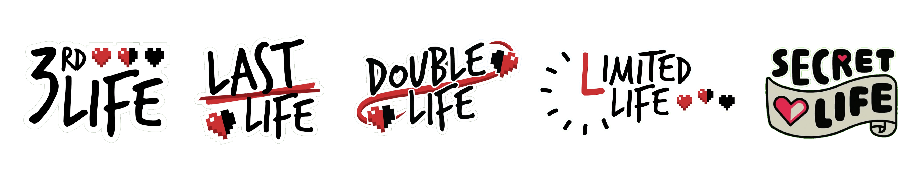

# Life Series Mod
This server-side mod aims to recreate [Grian](https://www.youtube.com/c/Grian)'s Life Series in minecraft fabric, with as many QOL features as possible. 
This includes automated lives tracking, automated team colors, automated session timer, automatic Boogeyman selection and kill tracking, and much more. 
Join the [Discord](https://discord.gg/QWJxfb4zQZ) or make an issue if you want to submit any bugs / give suggestions.
## Features

Currently, the first four seasons of the Life Series are implemented, the last two are much more complicated, but they are planned to be released.

| Third Life | Last Life | Double Life | Limited Life | Secret Life | | Wild Life  |
|------------|-----------|-------------|--------------|-------------|-|------------|
| Completed  | Completed | Completed   | Completed    | Completed | | Next up :/ |
-----
## Usage
### Selecting a series
After first starting a server with this mod installed, you will need to choose the series you want. You can do this with the `/lifeseries setSeries <series>` command. Don't worry, you don't have to remember all of this, you will be given instructions in chat ;)  
After you select your series, you must restart the server.

### Starting a session
To start a session, you must first set its length using `/session timer set <time>`. The `<time>` field is a string, which includes the hours, minutes and seconds you want the session to last - example valid values: `30m`,`1h`, `1h45m`, `2h35m20s`  
After you set your session time, you can simply run `/session start` to start the session. 

### The Blacklists
Every session has certain blacklisted items to prevent players from getting to overpowered, just like Grian's series, where some for example banned enchantment tables and similar OP items. 
Since I am creating this mod mainly for the group of players I am playing with, the Blacklists are catered to how we feel a balanced series should look like. 
For Example most of the series have maces, end crystals, strength pots,... banned. 
Blacklisted items are automatically deleted from inventories, and cannot even be crafted. 
A similar feature to the item blacklist is enchantment clamping, which limits specific (mainly combat) enchantments to level 1. 
On series where bookshelves are banned, the enchantment table has been modified a little bit to give all enchantments (because in vanilla its impossible to get some without bookshelves), and its also possible to get higher levels on some enchants directly from the table (like efficiency, unbreaking, fortune,...)

### Config
- The config files are all located in the `config/lifeseries/*` folder. There are files for every series, where you can modify the gameplay for each one of them. 
- Reload the config using `/lifeseries reload` or simply the vanilla `/reload`
- Currently, you can modify these (check the config files themselves for more info):
  - Default number of lives, the blacklists, Clamped enchants, spawn egg drop rates, if players drop items when they lose their last life ** and much, much more**.
  - Tasks in Secret Life (`config/lifeseries/secretlife/` folder) - there are three files, where you can modify / add / remove the easy, hard and red tasks.

## Commands & Subcommands
Unless specified otherwise (using "*No permissions required.*"), all commands can only be used by opped players (permissionLevel >= 2)

/lifeseries

This command **always** available
- `/lifeseries series` - Shows the selected series
- `/lifeseries version` - Shows the mod's version
- `/lifeseries credits` - Shows the mod's credits
- `/lifeseries setSeries <series>` - Changes the Series, only works if no series has been selected
  - `/lifeseries setSeries <series> confirm` - Changes the Series, can override the current series

/session

*This command is only available when you have selected a Series.*
- `/session start` - Starts the session, requires a timer to be set.
- `/session stop` - Stops the session.
- `/session pause` - Pauses / Unpauses the session.
- `/session timer`
  - `/session timer set <time>` - Sets the session time to `<time>`.
  - `/session timer add <time>` - Adds `<time>` to the session time.
  - `/session timer remove <time>` - Removes `<time>` from the session time.
  - `/session timer fastforward <time>` - Skips forward `<time>` when a session is active.
  - `/session timer remaining` - Shows the remaining session time. *No permissions required.*
  - `/session timer showDisplay` - Displays a permanent session timer in the actionbar of a player. *No permissions required.*

/lives

*This command is only available when you have selected a Series.*
- `/lives` - Shows you the amount of lives you have. *No permissions required.*
- `/lives reload` - Reloads the teams of all players. This should never be necessary to run.
- `/lives add <player> [amount]` - Adds `[amount]` lives to `<player>`. If `[amount]` is not specified, it defaults to 1.
- `/lives remove <player> [amount]` - Removes `[amount]` lives from `<player>`. If `[amount]` is not specified, it defaults to 1.
- `/lives set <player> <amount>` - Sets `<player>`'s lives to `<amount>`.
- `/lives get <player>` - Shows you how many lives `<player>` has.
- `/lives reset <player>` - Resets `<player>`'s lives.
- `/lives resetAll` - Resets the lives of all online and offline players.

/claimkill

*This command is only available when you have selected a Series.*
- `/claimkill <player>` - Used when you'd want to claim credit for a kill. For example you kill a player as the Boogeyman with a trap, so you don't get automatically cured. Or when you gain something for killing players in a series (like Limited Life). An admin must confirm this claim for you to be given the kill rewards. *No permissions required.*
- `/claimkill validate <killer> <victim>` - This is the command the admin uses to validate a claimed kill.

/boogeyman

*This command is only available when playing Last Life or Limited Life.*
- `/boogeyman list` - Shows you the list of all the Boogeymen.
- `/boogeyman clear` - Removes all Boogeymen.
- `/boogeyman add <player>` - Makes `<player>` the Boogeyman if they aren't one already.
- `/boogeyman remove <player>` - Makes `<player>` not be the Boogeyman if they were one.
- `/boogeyman cure <player>` - Cures `<player>` of the Boogeyman curse if they were the Boogeyman.
- `/boogeyman chooseRandom` - Chooses the Boogeyman / Boogeymen from the list of online players.

/health

*This command is only available when playing Secret Life.*
- `/health` - Shows you the amount of health you have (pr useless huh xD). *No permissions required.*
- `/health sync` - Synchronizes the health and max health of all players. This should never be necessary to run.
- `/health add <player> [amount]` - Adds `[amount]` health to `<player>`. If `[amount]` is not specified, it defaults to 1.
- `/health remove <player> [amount]` - Removes `[amount]` health from `<player>`. If `[amount]` is not specified, it defaults to 1.
- `/health set <player> <amount>` - Sets `<player>`'s health to `<amount>`.
- `/health get <player>` - Shows you how much health `<player>` has.
- `/health reset <player>` - Resets `<player>`'s health to 60 (default on Secret Life).
- `/health resetAll` - Resets the health of all online players to 60 (default on Secret Life).

Other series specific commands

- `/givelife <player>` - Gives one of your lives to `<player>`. *This command is only available when playing Last Life.* *No permissions required.*
- `/lastlife rollLives [<player>]` - Rolls 2-6 lives for everyone or for the `[<player>]`, if specified. *This command is only available when playing Last Life.*
- `/limitedlife time` - Same syntax as normal `/lives`, but with the <time> argument instead of numbers i am not writing it all down :). *This command is only available when playing Limited Life.*

- `/gift <player>` - Gives one free heart to `<player>`. *This command is only available when playing Secret Life.* *No permissions required.*

- `/task` - *These commands are only available when playing Secret Life.*
  - `/task succeed <player>` - Succeeds `<player>`'s task.
  - `/task fail <player>` - Fails `<player>`'s task.
  - `/task reroll <player>` - Re-rolls `<player>`'s task.
  - `/task assignRandom <player/s>` - Assigns a random task to `<player/s>`.
  - `/task clearTask <player>` - Clears the task book from `<player>`.

- `/soulmate` - *These commands are only available when playing Double Life.*
  - `/soulmate get <player>` - Shows you who `<player>`'s soulmate is.
  - `/soulmate set <player1> <player2>` - Makes `<player1>` be `<player2>`'s soulmate.
  - `/soulmate list` - Shows you all the soulmate pairs.
  - `/soulmate reset <player>` - Resets `<player>`'s soulmate.
  - `/soulmate resetAll` - Resets all soulmates.
  - `/soulmate rollRandom` - Rolls random soulmates from the list of online players.

